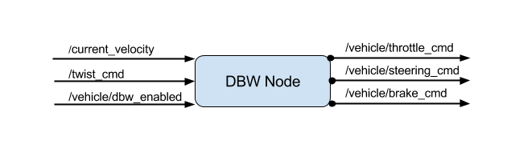

# Final Project - Programming a Real Self-Driving Car
[](http://www.udacity.com/drive)

This is the project repo for the final project of the Udacity Self-Driving Car Nanodegree: Programming a Real Self-Driving Car, which is a project to implement a self-driving car system with ROS running in both simulator and Udacity’s self-driving car - Carla.
For more information about the project, see the project introduction [here](https://classroom.udacity.com/nanodegrees/nd013/parts/6047fe34-d93c-4f50-8336-b70ef10cb4b2/modules/e1a23b06-329a-4684-a717-ad476f0d8dff/lessons/462c933d-9f24-42d3-8bdc-a08a5fc866e4/concepts/5ab4b122-83e6-436d-850f-9f4d26627fd9).

## ROS Nodes Architecture
Building ROS nodes for the self-driving car's communication and functionality implementation. So that the car can update waypoints and follow them, and also be able to stop at a red light.

- waypoint generator


- Drive-by-wire & control


- traffic light detection


## Rubric Points

### The code is built successfully and connects to the simulator.
- Running catkin_make, source devel/setup.sh and roslaunch launch/styx.launch within the ros directory results in no errors and allows the program to connect to the simulator.
### Waypoints are published to plan Carla’s route around the track.
- Waypoints are published to /final_waypoints to plan the vehicle’s path around the track. No unnecessary moves (excessive lane changes, unnecessary turning, unprompted stops) occur.

- As in the Path Planning project, acceleration does not exceed 10 m/s^2 and jerk does not exceed 10 m/s^3.

- Have limited the top speed of the vehicle to the km/h velocity set by the velocity rosparam in waypoint_loader.

### Controller commands are published to operate Carla’s throttle, brake, and steering.
- dbw_node.py has been implemented to calculate and provide appropriate throttle, brake, and steering commands.
- The commands are published to /vehicle/throttle_cmd, /vehicle/brake_cmd and /vehicle/steering_cmd, as applicable.

### Successfully navigate the full track more than once.
- The vehicle is able to complete more than one full loop of the track without running off road or any other navigational issues (incorrect turns, random stops, teleportation, etc.).

## Installation Guidance
### Native Installation

* Be sure that your workstation is running Ubuntu 16.04 Xenial Xerus or Ubuntu 14.04 Trusty Tahir. [Ubuntu downloads can be found here](https://www.ubuntu.com/download/desktop).
* If using a Virtual Machine to install Ubuntu, use the following configuration as minimum:
  * 2 CPU
  * 2 GB system memory
  * 25 GB of free hard drive space

  The Udacity provided virtual machine has ROS and Dataspeed DBW already installed, so you can skip the next two steps if you are using this.

* Follow these instructions to install ROS
  * [ROS Kinetic](http://wiki.ros.org/kinetic/Installation/Ubuntu) if you have Ubuntu 16.04.
  * [ROS Indigo](http://wiki.ros.org/indigo/Installation/Ubuntu) if you have Ubuntu 14.04.
* Download the [Udacity Simulator](https://github.com/udacity/CarND-Capstone/releases).

### Docker Installation
[Install Docker](https://docs.docker.com/engine/installation/)

Build the docker container
```bash
docker build . -t capstone
```

Run the docker file
```bash
docker run -p 4567:4567 -v $PWD:/capstone -v /tmp/log:/root/.ros/ --rm -it capstone
```

### Port Forwarding
To set up port forwarding, please refer to the "uWebSocketIO Starter Guide" found in the classroom (see Extended Kalman Filter Project lesson).

### Usage

1. Clone the project repository
```bash
git clone https://github.com/udacity/CarND-Capstone.git
```

2. Install python dependencies
```bash
cd CarND-Capstone
pip install -r requirements.txt
```
3. Make and run styx
```bash
cd ros
catkin_make
source devel/setup.sh
roslaunch launch/styx.launch
```
4. Run the simulator

### Real world testing
1. Download [training bag](https://s3-us-west-1.amazonaws.com/udacity-selfdrivingcar/traffic_light_bag_file.zip) that was recorded on the Udacity self-driving car.
2. Unzip the file
```bash
unzip traffic_light_bag_file.zip
```
3. Play the bag file
```bash
rosbag play -l traffic_light_bag_file/traffic_light_training.bag
```
4. Launch your project in site mode
```bash
cd CarND-Capstone/ros
roslaunch launch/site.launch
```
5. Confirm that traffic light detection works on real life images

### Other library/driver information
Outside of `requirements.txt`, here is information on other driver/library versions used in the simulator and Carla:

Specific to these libraries, the simulator grader and Carla use the following:

|        | Simulator | Carla  |
| :-----------: |:-------------:| :-----:|
| Nvidia driver | 384.130 | 384.130 |
| CUDA | 8.0.61 | 8.0.61 |
| cuDNN | 6.0.21 | 6.0.21 |
| TensorRT | N/A | N/A |
| OpenCV | 3.2.0-dev | 2.4.8 |
| OpenMP | N/A | N/A |

We are working on a fix to line up the OpenCV versions between the two.
